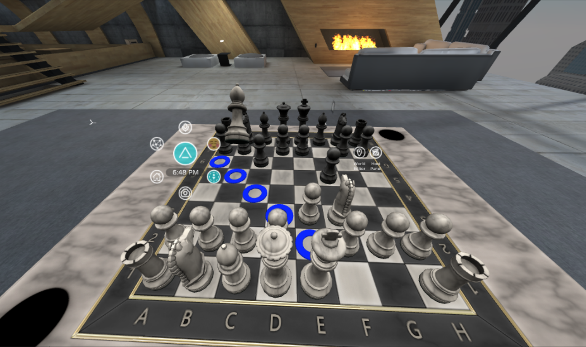

# MRE Chess

MRE Chess is a chess game written using the [Mixed Reality Extension SDK (MRE SDK)](https://github.com/microsoft/mixed-reality-extension-sdk).

MRE applications are Node.JS apps. Then run as a service in the cloud. When a connection is made from a supported platform, the app manifests in the environment on that platform.

## Supported platforms

- [MRETestBed (Unity project)](https://github.com/microsoft/mixed-reality-extension-unity)
- [AltspaceVR](https://altvr.com)
- Any platform that implements the Mixed Reality Extension Runtime API (needs link)

## How to build and run locally

### Prerequisites

* [Node.JS](https://nodejs.org) (v8.16.0 or greater)
* NPM (v6.4.1 or greater. Installs with Node.JS by default)

### First-time setup

1. Clone this repo
1. `cd mre-chess`
1. `npm install`
	> Note: If you get the "node-gyp.js" error during installation asking you to set a Python environment variable, ignore it and `npm install` again.

### Build and run

On the command line:

1. `npm run build`
1. `npm run start`

Your MRE app should now be running at `localhost:3901`.

### Connecting to your app

Connect to your MRE app from one of the supported platforms to interact with it.

#### From MRETestBed

The MRETestBed Unity project is a convenient place to test and develop your MRE app.

* Clone the [mixed-reality-extension-unity](https:github.com/microsoft/mixed-reality-extension-unity) repo and follow instructions there.

#### From AltspaceVR

* Follow the instructions at [Testing an MRE In AltspaceVR](https://github.com/Microsoft/mixed-reality-extension-sdk#testing-an-mre-in-altspacevr)

## Contributing

This project welcomes contributions and suggestions. Most contributions require you to agree to a Contributor License Agreement (CLA) declaring that you have the right to, and actually do, grant us the rights to use your contribution. For details, visit https://cla.microsoft.com.

When you submit a pull request, a CLA-bot will automatically determine whether you need to provide a CLA and decorate the PR appropriately (e.g., label, comment). Simply follow the instructions provided by the bot. You will only need to do this once across all repos using our CLA.

This project has adopted the Microsoft Open Source Code of Conduct. For more information see the Code of Conduct FAQ or contact opencode@microsoft.com with any additional questions or comments.
